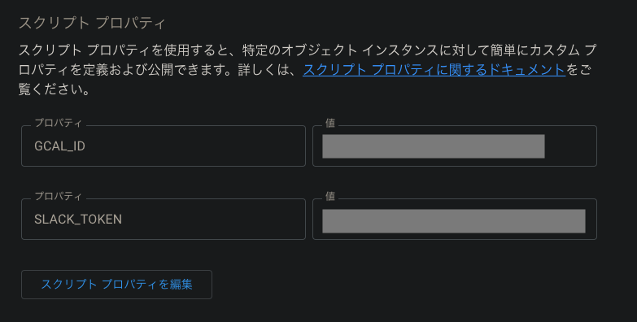

# slack-icon-changer

## 概要
SlackのカスタムステータスをGoogleカレンダーの予定に基づいて変更するGASスクリプトを作成する

## 機能
5分間隔でカスタムステータスを変更する

間隔はGASのページから変更可能

### テキスト
タイトル+終了時間をカスタムステータスのテキストに設定する
### 絵文字
* outOfOffice(不在)の場合、休みの絵文字
* 予定にゲストが存在する場合、GoogleMeetの絵文字
* それ以外の場合、カスタムステータスを空にする

## 使い方

```
git clone git@github.com:aRinTakahashi/slack-icon-changer.git
cd clasp-ts-template
```

1. packagesをインストールする
  ```bash
  yarn
  ```
2. claspにログインする
```bash
yarn clasp login
```

3. 新しいプロジェクトを作成する
```bash
yarn clasp create
```
4. root directoryに作られた `appscript.json`を削除する


5. .clasp.jsonにrootDirを追加する
```
{
  "scriptId":"xxxxxxxxxxxxx",
  "rootDir": "./dist" // !! Add this line !!
}
```

6. `yarn clasp login`したアカウントで以下のURLにアクセスし `Google Apps Script API` をONにする  

https://script.google.com/home/usersettings

7. プッシュする
```bash
yarn push
```

8. プッシュしたApps Scriptを開き、プロジェクトの設定からスクリプトプロパティにGCAL_IDとSLACK_TOKENを追加する


9. Apps Scriptを開いてエディタからsetTrigger関数を選択肢、実行ボタンを押下することで定期実行を設定する。

